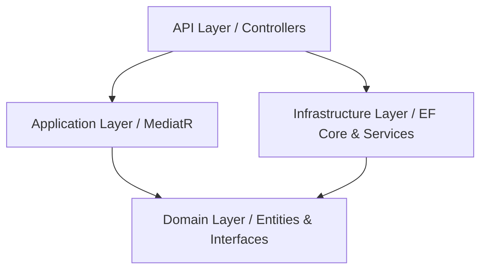

# StockNexus Backend API

## Project Overview

StockNexus is a robust backend API built with .NET 10, designed to manage inventory, products, and employee product requests. It provides a structured workflow for employees to request products and for managers to review and approve or deny those requests.

This API acts as the core backend for an inventory management platform, utilizing clean architecture principles, CQRS with MediatR, and comprehensive JWT-based authentication and authorization.

## Features

-   **User Authentication & Authorization**: Secure login and registration using JWT (JSON Web Tokens). Role-based access control (Admin, Manager, Employee).
-   **Product Management**: Full CRUD operations for managing the product catalog.
-   **Request Workflow system**: 
    -   Employees can submit requests for products.
    -   Managers can review, approve, or reject pending requests.
-   **Clean Architecture**: Separation of concerns into Domain, Application, Infrastructure, and API layers.
-   **CQRS Pattern**: Segregation of Read (Queries) and Write (Commands) operations using MediatR for scalable and maintainable code.
-   **Rate Limiting**: Integrated endpoint rate limiting to protect the API from abuse.
-   **Logging**: Comprehensive structured logging using Serilog.
-   **API Documentation**: Interactive documentation utilizing Swagger and OpenAPI.

## Tech Stack

-   **Framework**: .NET 10 (ASP.NET Core Web API)
-   **Language**: C#
-   **Architecture**: Clean Architecture, CQRS (Command Query Responsibility Segregation)
-   **Database**: Entity Framework Core
-   **Authentication**: JWT (JSON Web Tokens)
-   **Validation**: FluentValidation
-   **Mediator Pattern**: MediatR
-   **Logging**: Serilog
-   **API Documentation**: Swagger / OpenAPI

## Architecture Diagram (Logical)



## Getting Started

### Prerequisites

-   [.NET 10 SDK](https://dotnet.microsoft.com/download/dotnet/10.0)
-   [SQL Server](https://www.microsoft.com/en-us/sql-server/sql-server-downloads) 
-   Visual Studio or VS Code

### Setup Instructions

1.  **Clone the repository:**
    ```bash
    git clone https://github.com/LMoares/StockNexus.git
    cd StockNexus
    ```

2.  **Navigate to the API project:**
    ```bash
    cd StockNexusAPI
    ```

3.  **Database Configuration:**
    Ensure your `appsettings.Development.json` or `appsettings.json` has the correct connection string for your local SQL Server instance.

4.  **Apply Migrations:**
    Run the following command to create the database and apply the initial schema:
    ```bash
    dotnet ef database update
    ```

5.  **Run the Application:**
    ```bash
    dotnet run
    ```

6.  **Access Swagger UI:**
    Navigate to the `/swagger` endpoint in your browser to interact with the API.

## Key API Endpoints

-   **Authentication**: `/api/User/login`, `/api/User/register`, `/api/User/register-admin`
-   **Products**: `GET /api/Product`, `POST /api/Product`, `DELETE /api/Product/{id}`
-   **Requests**: `POST /api/ProductRequests`, `GET /api/ProductRequests/employee`, `GET /api/ProductRequests/manager`, `PUT /api/ProductRequests/{id}/review`


